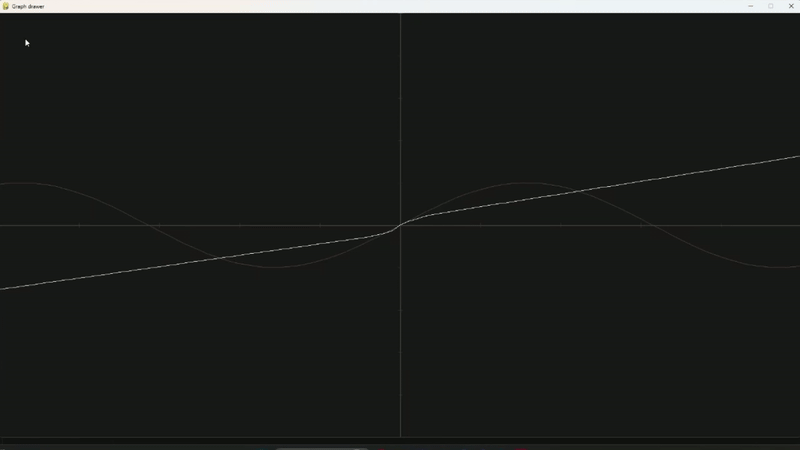
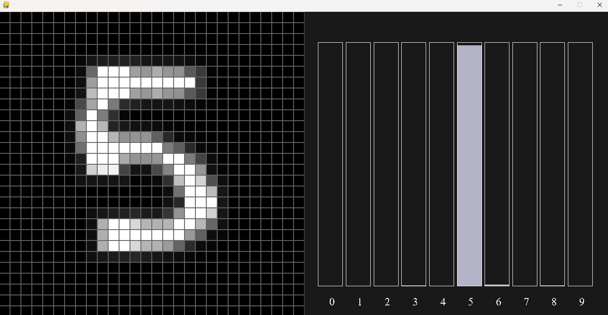
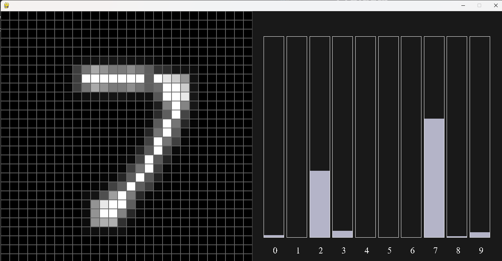
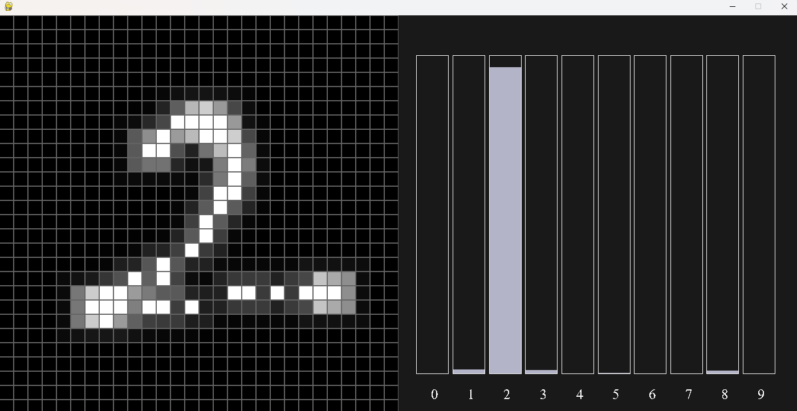
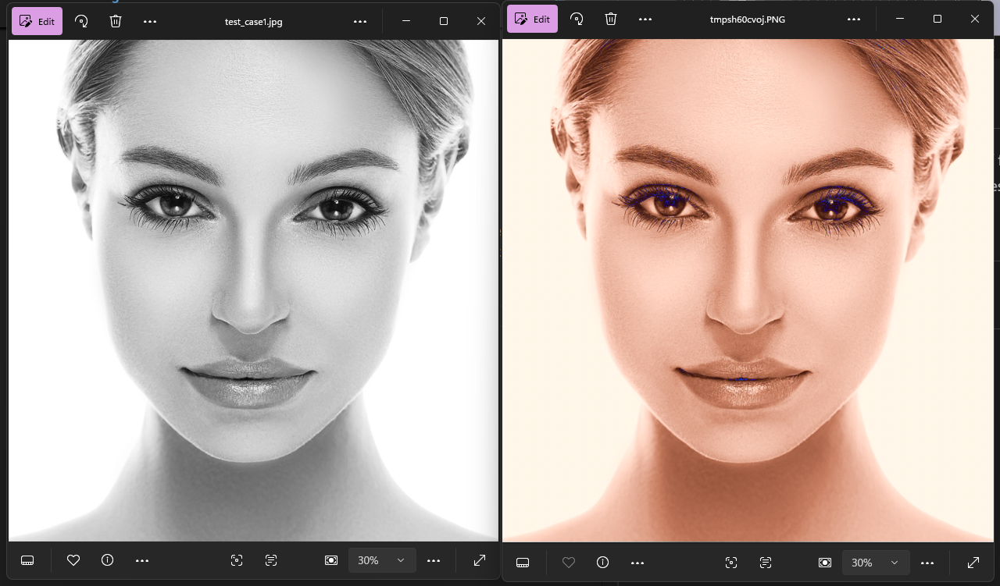
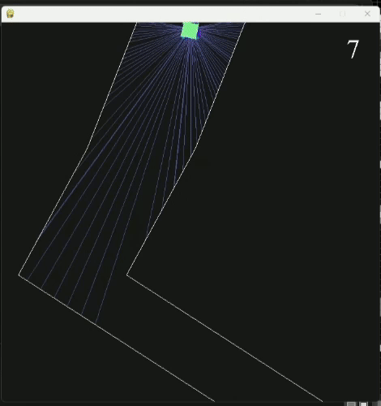

# Neural Networks from scratch
This solo project is a Neural Network built from scratch in python (only numpy and raw python).


> The core source code is "Neural Network.py" in root directory, containing 90 lines of python code, offering an efficient, flexible Neural Network object in python. (Running by CPU power using numpy)

### Features
- Custom Neural Network for **any size**
- **Forward** method
- Train method:
    - Back propagation using **Gradient decent**
- Random values at init
- Load / Save network (weights and biases)

Use cases and trained networks are in subdirectory and are powered by the core source file, with small adjustments.

## Example
```python
nn = NeuralNetwork(1, 10, 30, 30, 30, 1)  
nn.train(a, true_a, batch_size=64, learning_rate=0.01) 
nn.forward(x)
```
Where:
- a: input vales (python list[int/float])
- true_a: expected values (lable) (python list[int/float])
- forward output: numpy array object


# Clone the repo
to clone the repo (under **MIT LICENSE**), run command:
```bash
git clone https://github.com/AriK822/Neural-Network-from-scratch.git
```


# Projects
## Visualazation
A simple visualization of how the network learns and works on simple functions like sin(x) and x^2.

Simply run the file. A pygame window will pop up:
### Preview



## Mnist dataset
Network is trained on the famous Mnist dataset. I got 96% accuracy. You can test the network by running "hand written recognizer.py" and using mouse to draw number, pressing "a" to view the prediction, and pressing "Space bar" to reset:
### Preview





## Image colorizer
Trained the Network for colorizeing images of faces.
You can view the reaults by running "image colorizer/colorize test.py":
## Preview



## Genetic algorithm
Made a simple 2D driving game in pygame.
Used genetic algorithm. AI learns to play the game:
- Input: 7 ray casts in car direction
- Output: Right/Left/Strait

### Preview
Generation 7:



# To do
- Convelutional neural networks:
    - img quality enhancer
